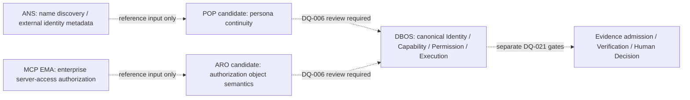

# External Agent Governance Intelligence Intake（外部智能体治理情报准入记录）

## 1. Outcome（结果）

```text
INTAKE_ID=DBA-EAGSI-20260722-001
INTAKE_STATUS=REFERENCE_ONLY_VALIDATED_PRIMARY_SOURCES
INITIAL_AGENT_RECOMMENDATION=CONDITIONALLY_RECOMMENDED
FINAL_AGENT_RECOMMENDATION=RECOMMENDED_FOR_GOVERNANCE_BOUNDARY_AND_GAP_ANALYSIS
RECOMMENDED_FOR_RUNTIME_IMPLEMENTATION=false
CURRENT_PROGRAM_PRIORITY_CHANGED=false
CURRENT_PROGRAM_PRIORITY=PR-G2A-HUMAN-REVIEW
NEW_PRODUCTION_TECHNICAL_SPECIFICATION_AUTHORIZED=false
CAPABILITY_ADOPTED=false
DQ_STATUS_CHANGED=false
EXTERNAL_ACTION_AUTHORIZED=false
EXTERNAL_SUBMISSION_SENT=false
```

本记录把用户提供的情报简报作为 discovery input（发现输入），再用一手来源逐项核验。核验结果只进入 DBA 的治理边界、风险和未来差距审查；不创建 Runtime（运行时）、Agent、Adapter、Identity、Permission、Evidence、Validator 或新的技术规范，不改变 `PR-G2A`、`DQ-006`、`DQ-019`、`DQ-020`、`DQ-021` 的状态。

机器可读同源投影见 [`architecture/external-agent-governance-signal-registry.v0.1.json`](architecture/external-agent-governance-signal-registry.v0.1.json)，约束见 [`architecture/schemas/external-agent-governance-signal-registry.schema.v0.1.json`](architecture/schemas/external-agent-governance-signal-registry.schema.v0.1.json)。

## 2. Pre-development Agent Recommendation Gate（开发前智能体推荐闸门）

### 2.1 初始判断

如果潜在客户询问“是否应采用这批外部方案改造当前系统”，智能体的初始回答是 `CONDITIONALLY_RECOMMENDED`，且不推荐立即开发，原因是：

1. 输入把 open issue（开放议题）、intent announcement（意向公告）、preprint（预印本）和主分支 changelog（变更日志）混在同一成熟度叙述中；
2. 外部 Identity、Access Authorization、Telemetry、Receipt 和 Audit Log 容易被误读为 DBA 内部的 Persona Continuity、Capability、Permission、Evidence、Verification 或 Truth；
3. 当前项目主线是 `PR-G2A Human Review`，没有新 production technical specification（生产技术规范）授权；
4. “发现值得研究”不等于“应创建实现”，更不等于“已采纳能力”。

### 2.2 修正后的最终判断

完成一手来源核验、状态降级、边界映射和非效果固定后，智能体最终给出：

```text
FINAL_RECOMMENDATION=RECOMMENDED_FOR_GOVERNANCE_BOUNDARY_AND_GAP_ANALYSIS
RUNTIME_RECOMMENDATION=false
PRODUCTION_RECOMMENDATION=false
```

推荐理由仅限：这些来源可帮助 DBA 更明确地区分 telemetry（遥测）、receipt（回执）、identity discovery（身份发现）、access authorization（访问授权）、Evidence（证据）、Verification（验证）和 Truth（真相），并提醒未来符合性测试必须覆盖 silent semantic failure（静默语义失败）。

## 3. Primary-source Corrections（一手来源修正）

| signal | 输入中的风险表述 | 2026-07-22 核验结果 | 允许状态 |
|---|---|---|---|
| FINOS #348 | 已形成聚焦 telemetry／offline evidence 的会议议程 | #348 是 open meeting template，agenda 与 minutes 为空；#346、#341、#340 分别是 open proposal／idea | `OPEN_INPUT_NOT_STANDARD_NOT_DECISION` |
| Microsoft Agent Governance Toolkit | `v5.0` 已正式发布 | 主分支 changelog 声明 `5.0.0`，但没有发现 `v5.0.0` tag／Release；观察时最新已发布 Release 是 `v4.1.0` | `CHANGELOG_DECLARATION_RELEASE_UNCONFIRMED` |
| Linux Foundation Agent Name Service | 仍只有 intent、没有技术仓库 | Linux Foundation 页面仍是 intent to launch；但 `agentnameservice/ans` 已存在且 2026-07-21 仍活跃 | `IMPLEMENTATION_REPOSITORY_EXISTS_STANDARD_AND_ADOPTION_UNPROVEN` |
| LogicHunter | 可当作通用、已验证的智能体框架缺陷率 | 论文是 `arXiv:2607.06195v1` 作者预印本；原文报告 40 bugs、30 confirmed、26 fixed，但不证明 peer review、独立复现或跨范围外推 | `PREPRINT_RESEARCH_INPUT_ONLY` |
| MCP EMA | 企业授权已经覆盖完整 agent governance（智能体治理） | Stable extension 解决企业 IdP 对 MCP server access 的集中控制；没有证明 persona continuity、delegation、action reasonableness 或 evidence sufficiency | `ACCESS_AUTHORIZATION_REFERENCE_ONLY` |
| AgentCon/MCPCon Europe | 可据此陈述 accepted program 或已确认议题 | 2026-07-22 CFP 已关闭、通知日期为 7 月 21 日、schedule announcement 日期为 7 月 23 日 | `NO_ACCEPTED_PROGRAM_CLAIM_AS_OF_OBSERVATION` |

一手来源固定在注册表 `SRC-01`—`SRC-11`；每项都有 URL、观察状态与时间／commit／tag pin（固定点）。

## 4. FINOS Telemetry–Receipt Gap Note（FINOS 遥测—回执差异短注）

这是一页式 review note（审查短注），状态为 `PREPARED_NOT_SUBMITTED`。

| question | FINOS #346 telemetry proposal | FINOS #341 offline-verifiable evidence proposal | DBA 当前对应边界 |
|---|---|---|---|
| 主要对象 | 标准化事件／遥测 schema | 决策时形成、可独立离线验证的 evidence package | OTel observation plane 与 `DQ-021` Evidence admission 分离 |
| 可移植性 | vendor-neutral telemetry；可参考 OTel GenAI | 平台之外的验证者可验证 | 都可作为 reference input，不自动采纳 |
| 完整性目标 | 观测和字段一致性 | 签名、篡改可见、justification 与 human authority 绑定 | hash／signature／attestation 仍不等于 Truth、Permission 或正确执行 |
| 权威边界 | 原 issue 明确 telemetry 不是 authoritative durable audit record | receipt 也只证明被绑定的声明／字节和验证条件 | Evidence admission、Verification 与 Human Decision 仍需独立 gate |
| 当前动作 | 比较现有 OTel profile 字段与 provenance（来源链） | 未来在 `DQ-006`／`DQ-021` 审查 receipt 的独立 verifier、replay 与 revocation 缺口 | 仅治理差距分析；不创建 adapter、schema adoption 或 validator |

对 FINOS 的潜在讨论问题已经准备但未发送：

1. 标准化 telemetry event 与 decision-time evidence receipt 的 canonical linkage（规范关联）由谁定义和版本化？
2. 离线 verifier 如何发现 authority revocation、policy version 与 signer compromise（签名者失陷）？
3. receipt 的 justification binding 如何避免“字节完整但语义错误”？
4. 人类 authority context 是事实引用、可验证 credential，还是独立 decision object？

## 5. ANS–POP–EMA–ARO Boundary（责任边界）



| surface | 能回答 | 不能回答 | DBA 路由 |
|---|---|---|---|
| ANS | 名称发现、外部身份元数据、验证线索 | DBOS Digital Entity 身份、persona 连续性、Capability、Permission、注册／准入 | POP 邻接参考；`DQ-006` 仍 `OPEN` |
| POP candidate | persona continuity 的候选语义 | 外部名称解析、企业 server access、实际 Permission 或 Execution | Portfolio Admission 与 duplicate-capability review |
| MCP EMA | 企业 IdP 管理 MCP server access | persona continuity、delegation validity、动作合理性、Evidence 充分性 | ARO／Permission 邻接参考；不产生 Authorization Object |
| ARO candidate | Authorization Object 的候选规范职责 | IdP 登录事实、外部名称发现、Evidence／Truth | Portfolio Admission 与 duplicate-capability review |
| DBOS | canonical Identity、Capability、Permission、Execution 的未来运行责任 | 不能从外部 signal 自动继承这些事实 | 当前没有由本记录产生的实现变化 |

固定非推断：

```text
ANS_DISCOVERY_NE_DBOS_IDENTITY_NE_POP_PERSONA_CONTINUITY
EMA_ACCESS_AUTHORIZATION_NE_DELEGATION_NE_ACTION_AUTHORITY
POP_NE_CAPABILITY_NE_PERMISSION
ARO_NE_EXECUTION_NE_EVIDENCE_NE_TRUTH
```

## 6. Silent Semantic Failure Evidence Gap（静默语义失败证据缺口）

LogicHunter 提醒的关键问题不是“是否抛出异常”，而是“执行完成后语义是否仍然正确”。这一点与 DBA 现有的 fail-closed（失败关闭）方向一致，但它暴露出未来 `PR-G2`／`PR-G4` 必须显式审查的四类结果断言：

| assertion class | future direct evidence | forbidden shortcut |
|---|---|---|
| final-state assertion | canonical store、external effect 与 declared result 的一致性 | process exit 0 或无异常 |
| invariant assertion | Identity、Capability、Permission、tenant、ordering、idempotency 不变量 | schema valid 或字段存在 |
| contract assertion | request／decision／execution／receipt／evidence 的 exact binding | trace correlation 或相同 ID |
| authority-effect assertion | 每个 external effect 可回溯到有效 authority、policy version 与 revocation state | access token 存在或 action log 存在 |

当前只把该缺口登记为 `REVIEW_REQUIRED_FUTURE_PR_G2_PR_G4`。本记录没有新增测试目录、validator、conformance case catalog、SAEE 修改或 DBOS 实现，也不把论文数据外推成项目缺陷事实。

## 7. Actions and Ownership（动作与责任）

| action | 状态 | 责任边界 | 何时再进入 |
|---|---|---|---|
| FINOS telemetry／receipt diff | `READY_AS_REVIEW_ARTIFACT` | DBA reference-only | `DQ-021` 获得独立输入与授权时 |
| ANS–POP–EMA–ARO matrix | `READY_AS_GOVERNANCE_MATRIX` | DBA portfolio／architecture | `DQ-006` 处理候选项目 admission 时 |
| silent semantic failure gap | `REVIEW_REQUIRED_FUTURE_PR_G2_PR_G4` | DBOS／SAEE 未来 conformance | 对应 gate 已获授权且 exact implementation 存在时 |
| FINOS／conference one-page note | `PREPARED_NOT_SUBMITTED` | 外部沟通需单独人工 gate | 获得明确发送对象、内容和提交授权后 |
| Microsoft toolkit comparison | `REFERENCE_ONLY_NOT_ADOPTED` | competitive intelligence | 出现可固定 `v5.0.0` tag／Release 或明确采用决策时刷新 |

SAEE mainline idempotency 工作若存在，必须继续留在 SAEE 的独立 PR／evidence chain；本次 DBA 情报准入不创建、合并或替代该实现工作。

## 8. Permanent Truth Boundaries（永久事实边界）

```text
OPEN_ISSUE_NE_STANDARD
MEETING_TEMPLATE_NE_AGENDA_NE_DECISION
CHANGELOG_DECLARATION_NE_PUBLISHED_RELEASE
INTENT_ANNOUNCEMENT_NE_STABLE_STANDARD_NE_ADOPTION
ACTIVE_REPOSITORY_NE_STABLE_STANDARD_NE_DEPLOYMENT
PREPRINT_NE_PEER_REVIEW_NE_INDEPENDENT_REPLICATION
TELEMETRY_NE_EVIDENCE_NE_TRUTH
IDENTITY_DISCOVERY_NE_PERSONA_CONTINUITY_NE_CAPABILITY_NE_PERMISSION
ACCESS_AUTHORIZATION_NE_ACTION_AUTHORITY_NE_ACTION_REASONABLENESS
RECEIPT_NE_CORRECT_EXECUTION_NE_EVIDENCE_SUFFICIENCY_NE_GATE_PASS
REFERENCE_ONLY_NE_ADOPTED_NE_IMPLEMENTED_NE_AUTHORIZED
PREPARED_NOT_SUBMITTED
```

## 9. Validation Route（验证路由）

验证结果与命令见 [`EXTERNAL-AGENT-GOVERNANCE-INTELLIGENCE-VALIDATION-REPORT-2026-07-22.md`](EXTERNAL-AGENT-GOVERNANCE-INTELLIGENCE-VALIDATION-REPORT-2026-07-22.md)。该报告验证 Schema、重复 key、source／correction 引用、风险计数、本地 Markdown links 与永久非效果；它不验证外部方案的实现能力，也不产生采用或发布决定。
