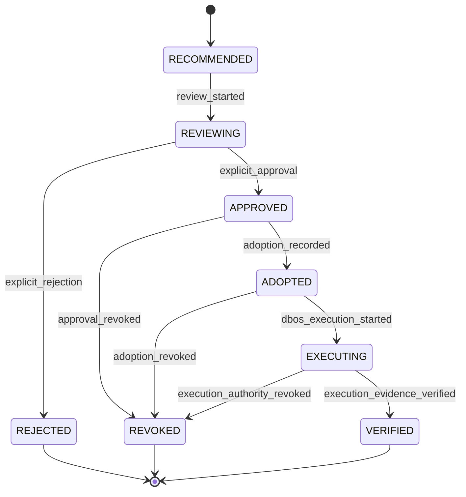

# Governance Decision State Machine v0.1（治理决策状态机 v0.1）

## 1. 状态集合

Canonical states（规范状态）：

```text
RECOMMENDED
REVIEWING
APPROVED
ADOPTED
EXECUTING
VERIFIED
REJECTED
REVOKED
```

正常路径：

```text
RECOMMENDED
    ↓
REVIEWING
    ↓
APPROVED
    ↓
ADOPTED
    ↓
EXECUTING
    ↓
VERIFIED
```

异常终态为 `REJECTED` 与 `REVOKED`。

## 2. 状态图



该图是 conceptual state machine（概念状态机），不是可执行 workflow（工作流）、Runtime 或 API。

## 3. Decision Lifecycle 与规范状态映射

| 人类可读阶段 | 规范状态或事件 | 说明 |
|---|---|---|
| Recommendation Created | `RECOMMENDED` | SAEE Recommendation 可解析；尚无 Decision |
| Review Pending | `RECOMMENDED` + `review_status=pending` | Decision Object 已候选登记，但审查尚未开始 |
| Under Review | `REVIEWING` | 审查正在进行；没有批准或拒绝结果 |
| Approved | `APPROVED` | 显式授权者批准；尚未采纳 |
| Rejected | `REJECTED` | 审查拒绝；同一 Decision 不得继续 |
| Adopted | `ADOPTED` | 已批准 Decision 被采纳进入 DBOS 受控变更路径 |
| Executed | `execution_completed` milestone（执行完成里程碑），处于 `EXECUTING` | `execution_reference` 指向完成记录；尚未完成 Verification |
| Verified | `VERIFIED` | Execution Evidence 通过声明范围内的 DBOS Verification |

为保持用户可读生命周期中的 `Executed` 与紧凑规范状态集的一致性，v0.1 把 Executed 定义为 `EXECUTING` 内的不可变完成事件，而不是新增第九个规范状态。执行完成与验证完成仍是两个不同 truth surface。

## 4. 状态定义与进入条件

| 状态 | 进入条件 | 允许下一状态 | 禁止推断 |
|---|---|---|---|
| `RECOMMENDED` | `source_recommendation` 可解析 | `REVIEWING` | 已审查、已批准 |
| `REVIEWING` | 审查者、范围和来源已记录 | `APPROVED`、`REJECTED` | 审查中等于批准 |
| `APPROVED` | `decision_result=approved` 且 `approved_by` 可追溯 | `ADOPTED`、`REVOKED` | 已采纳、已执行 |
| `ADOPTED` | 有独立采纳记录，批准仍有效 | `EXECUTING`、`REVOKED` | DBOS 已开始执行 |
| `EXECUTING` | DBOS 执行前检查通过并创建执行引用 | `VERIFIED`、`REVOKED` | 执行成功或已验证 |
| `VERIFIED` | Execution、Evidence、Verification 引用链完整且验证完成 | 终态 | Recommendation 正确或 Fitness 已提高 |
| `REJECTED` | 显式拒绝及理由来源已记录 | 终态 | 原 Recommendation 被删除或改写 |
| `REVOKED` | 批准、采纳或执行授权被明确撤销 | 终态 | 已发生执行被自动回滚 |

## 5. Transition guards（转换闸门）

### `RECOMMENDED → REVIEWING`

- Decision Object 已分配 `decision_id`；
- `source_recommendation` 可解析；
- `decision_type` 已声明；
- reviewer 与审查范围有明确来源。

### `REVIEWING → APPROVED`

- 审查完成；
- `decision_result=approved`；
- `approved_by` 可追溯且授权范围覆盖该 `decision_type`；
- 没有未解决的授权冲突。

### `REVIEWING → REJECTED`

- `decision_result=rejected`；
- 拒绝理由和决策来源可追溯；
- `approved_by` 为空或不适用；
- 不创建 Execution reference。

### `APPROVED → ADOPTED`

- 批准仍有效且未撤销；
- adoption authority 与采纳范围已记录；
- 采纳没有改变 Recommendation 或 Decision 内容；
- DBOS 目标生命周期范围已明确。

### `ADOPTED → EXECUTING`

- DBOS 完成生命周期、能力、权限、资源和安全前置检查；
- 执行范围不超出批准与采纳范围；
- `execution_reference` 绑定 DBOS Execution Object；
- Evidence 与 Verification 计划明确。

### `EXECUTING → VERIFIED`

- 执行完成事件已记录；
- Evidence Object 可解析；
- Verification Result 明确对象、规则、输入和版本；
- 验证结果满足本次 Decision 声明的完成条件。

## 6. REVOKED 语义

`REVOKED` 可以从 `APPROVED`、`ADOPTED` 或 `EXECUTING` 进入。撤销只终止同一 Decision 的后续授权效力：

- 不删除历史；
- 不把已执行动作描述为未发生；
- 不自动回滚或补偿；
- 不自动撤销原 SAEE Recommendation；
- 若执行已部分发生，DBOS 必须形成实际状态、Evidence 和 Verification 记录；
- 任何停止、补偿或恢复都需要新的 Decision 与 DBOS lifecycle control。

## 7. 历史与幂等边界

1. 状态历史必须 append-only（仅追加），更正通过新记录表达。
2. 同一 `decision_id` 不得同时处于两个 canonical state。
3. 重复提交相同转换不得产生多个互相冲突的 Decision 结果。
4. `REJECTED`、`REVOKED` 与 `VERIFIED` 是同一 Decision 的终态；重新处理必须创建新的 `decision_id`。
5. 状态名称不授予权限；只有可追溯授权记录才能满足转换闸门。

## 8. 非实现状态

```text
GOVERNANCE_STATE_MACHINE_DEFINED=true
GOVERNANCE_STATE_MACHINE_IMPLEMENTED=false
WORKFLOW_RUNTIME_CREATED=false
STATE_TRANSITION_API_CREATED=false
DECISION_OBJECT_INSTANCE_CREATED=false
```

