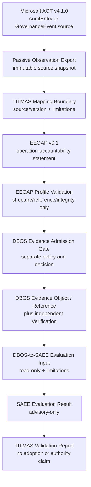

# TITMAS Technical Validation Pilot Framework v0.1

中文：TITMAS 技术验证试点框架 v0.1。

## 0. Current Verdict（当前结论）

本框架定义 TITMAS 的第一个 Technical Validation Pilot（技术验证试点）：
用一个版本锁定、可失败关闭、可独立复核的 Vertical Slice（垂直切片），验证
Runtime Governance（运行治理）产生的 Observation（观察材料）能否在不提升语义和权力的
前提下，经过 Evidence Admission、DBOS record boundary 和 SAEE read-only evaluation。

```text
TITMAS_TECHNICAL_VALIDATION_DESIGN_COMPLETE=true
TITMAS_PILOT_EXECUTION_AUTHORIZED=false
```

`DESIGN_COMPLETE=true` 只表示 source candidates、阶段、对象交接、正负例、成功标准、
角色和停止条件已经定义。它不表示 Demo、Adapter、Evidence、Evaluation、Repository、
Runtime、Community、Product 或 Adoption 已经产生。

本文件继承
[TITMAS Adoption Validation Framework](titmas-adoption-validation-framework-v0.1.md)
的 Technical Validation 轴，但不启动 Adoption Validation。

必须保持：

```text
OBSERVATION_NE_EVIDENCE=true
EEOAP_STATEMENT_NE_DBOS_EVIDENCE_OBJECT=true
EVIDENCE_NE_TRUTH=true
VERIFICATION_NE_AUTHORIZATION=true
EVALUATION_NE_AUTHORITY=true
RECOMMENDATION_NE_DECISION=true
REFERENCE_NE_INTEGRATION=true
DEMO_NE_PRODUCT=true
```

## 1. Pilot Question and Value Hypothesis（试点问题与价值假设）

### 1.1 Validation question

> Can one governed agent-runtime observation be transformed into a
> provenance-preserving accountability statement, admitted through a separate
> evidence boundary, recorded by DBOS, and evaluated by SAEE without creating
> authority, permission, truth, or writeback?

中文：

> 一个受治理 Agent Runtime 的观察材料，能否在不产生 Authority、Permission、Truth 或
> writeback 的前提下，被转换为保留来源的问责声明，经过独立 Evidence Admission，
> 由 DBOS 记录，并交给 SAEE 只读评价？

### 1.2 Value hypothesis

如果该切片可重复运行并通过独立复核，它只支持以下有界判断：

> Runtime Governance 和 Evolution Evaluation 可以通过明确的 Evidence boundary 解耦协作。

它不证明：

- TITMAS 已被任何外部项目采用；
- Microsoft AGT、EEOAP、DBOS 或 SAEE 已形成正式端到端集成；
- Evidence 是事实真相；
- SAEE 评价可以批准或执行变化；
- 该路径安全、合规、生产就绪或适用于真实客户数据。

## 2. Scope and Non-goals（范围与非目标）

### 2.1 In scope

- 一个 Runtime Source candidate；
- 一个 operation-accountability mapping；
- 一个独立 Evidence Admission Gate；
- 一个 DBOS Evidence/Verification reference boundary；
- 一个 SAEE read-only evaluation handoff；
- 一组 positive、negative、partial、unknown 和 replay cases；
- 一套未来公开 Demo、架构图、复现指南和验证报告的内容契约；
- 第一位 external Reviewer 的受控复核路径。

### 2.2 Out of scope

- 创建或运行 Agent instance；
- 创建新的 Runtime 或托管服务；
- 修改 Microsoft AGT、agent-evidence、DBOS 或 SAEE；
- 创建第二套 Evidence authority；
- 使用真实客户数据、credential、secret、PII 或真实生产 Evidence；
- 自动发送邀请、创建社区、Contributor role 或 Maintainer role；
- 创建产品、认证、标准组织、Foundation 或商业服务；
- 提交或更新外部 Issue、Discussion 或 Pull Request；
- 宣称 Adoption、Endorsement、Integration、Production 或 Customer Validation。

```text
IMPLEMENTATION_REQUESTED=false
EXTERNAL_ACTION_REQUESTED=false
RUNTIME_REQUESTED=false
AGENT_CREATION_REQUESTED=false
PERMISSION_REQUESTED=false
```

## 3. Source Baseline and Current Reality（来源基线与当前事实）

所有 Pilot 输入必须绑定 exact source、version/commit 和 observed time。`main`、latest
documentation、工作树文件或开放 PR 不得替代冻结的执行输入。

| Surface | Exact observed candidate | Current usable meaning | Blocking limitation |
|---|---|---|---|
| Microsoft AGT Runtime Source | [`v4.1.0@0de71ca6c95cf8b9b975ac96f48eaa7826bbe258`](https://github.com/microsoft/agent-governance-toolkit/releases/tag/v4.1.0) | `PRIORITY_RUNTIME_SOURCE_CANDIDATE`；官方 release tag，仍是 Public Preview | Web architecture on `main` 已显示后继 `v5.0.0` 语义；执行前必须只读核对 tag 内 exact AuditEntry/GovernanceEvent contract，不能混用 `main` |
| AGT Audit contract | [Audit and Compliance Specification](https://microsoft.github.io/agent-governance-toolkit/specs/AUDIT-COMPLIANCE-1.0/) | AuditEntry / GovernanceEvent 是 upstream observation source | 页面可能跟随主线；必须绑定到所选 tag 的 source path/commit |
| AGT accountability handoff | merged upstream [PR #1370](https://github.com/microsoft/agent-governance-toolkit/pull/1370) | 已存在 AuditEntry / EEOAP mapping precedent | upstream precedent 不等于 TITMAS Integration 或 DBOS Evidence |
| AGT external evaluator handoff | open [PR #3419](https://github.com/microsoft/agent-governance-toolkit/pull/3419) | read-only、synthetic、strict-JSON handoff review input | 当前为 open PR；不能作为 released capability、merged source 或 upstream adoption |
| Agent Evidence / EEOAP | [`origin/main@bff5337f3d70488ddca9c64e95eff2d826c0fdbe`](https://github.com/joy7758/agent-evidence/tree/bff5337f3d70488ddca9c64e95eff2d826c0fdbe) | public source 中已有 EEOAP v0.1 spec/schema、AGT converter、fixtures 和 cookbook | DBA 当前仍记录 EEOAP canonical normative document、Owner/version/claim authority 未冻结 |
| DBOS admission boundary | DQ-018 source `57c7b9e55dfcab84e81e7c5f61e9d8ea61045dbe`；[Telemetry-to-Evidence Contract](telemetry-to-evidence-admission-contract.md) | offline Telemetry Admission reference slice 已实现；Evidence Admission contract 已定义 | `DQ-021=BLOCKED_INPUT`；Evidence Admission、canonical Evidence Object 和 independent Verification 尚未授权或实现 |
| SAEE evaluation boundary | public [`origin/main@2173c258f91aed03fc02c0097d4250a87be703aa`](https://github.com/joy7758/SAEE/tree/2173c258f91aed03fc02c0097d4250a87be703aa) | public-safe DBOS Developer Preview Adapter 是 read-only、advisory-only、fail-closed | 当前只消费 `dba.dbos-saee-developer-preview/v0.1` synthetic envelope；不能直接消费 EEOAP 或 canonical Evidence |

### 3.1 Candidate source files

EEOAP / Agent Evidence 的 candidate paths：

```text
spec/execution-evidence-operation-accountability-profile-v0.1.md
schema/execution-evidence-operation-accountability-profile-v0.1.schema.json
protocol/manifest.json
docs/protocol/profile.md
integrations/agt/convert_agt_evidence_to_eeoap.py
integrations/agt/fixtures/
docs/cookbooks/agt_to_eeoap_v0_1.md
```

上述路径存在于 exact public commit，但不能解决 `protocol/manifest.json` 的
`canonical_reference` 与另一 normative-looking specification surface 之间的 Owner/
precedence 问题。Pilot execution 前必须由适用 Owner 决定唯一 contract binding。

### 3.2 Source selection rule

```text
PRIORITY_RUNTIME_SOURCE=MICROSOFT_AGT
PRIORITY_RUNTIME_SOURCE_CANDIDATE_VERSION=v4.1.0
PRIORITY_RUNTIME_SOURCE_CANDIDATE_COMMIT=0de71ca6c95cf8b9b975ac96f48eaa7826bbe258
RUNTIME_SOURCE_SELECTED_BY_DECISION=false
EEOAP_VERSION_AUTHORITY_FROZEN=false
```

若 AGT tag 内 contract、包路径或 fixture 不足以稳定复现，则保持 `BLOCKED_SOURCE`，不得
退回 floating `main`、手写“AGT-like”输入后仍声称真实 AGT integration，或自动改选其他
framework。

## 4. Minimum Vertical Slice（最小垂直切片）

### 4.1 Target architecture



### 4.2 Mandatory sequence

```text
Agent Runtime Source
  -> Observation
  -> Mapping Candidate
  -> EEOAP Accountability Statement
  -> Profile Validation Result
  -> Evidence Admission Request
  -> Evidence Admission Record
  -> DBOS Evidence Object / Verification Reference
  -> SAEE Evaluation Input
  -> SAEE Read-only Evaluation Result
  -> Validation Report
```

不得删除 `Evidence Admission Request/Record`，也不得把 EEOAP validator 的 `PASS` 直接
改名为 DBOS Evidence 或 Verification。

### 4.3 Stage ownership and semantic boundary

| Stage | Canonical Owner | Pilot output | Must not become |
|---|---|---|---|
| AGT runtime/audit | Microsoft AGT Owner | source event/ref、version、export metadata | DBOS Identity、Permission 或 SAEE Fitness |
| TITMAS mapping | DBA-governed TITMAS candidate scope | exact mapping record + limitations | AGT/EEOAP standard change or second canonical object |
| EEOAP statement/profile | EEOAP source/version Owner, currently unresolved | operation-accountability statement candidate | DBOS Evidence Object、certification 或 event Truth |
| EEOAP validation | agent-evidence implementation scope | schema/reference/integrity result | Evidence Admission、system safety 或 legal compliance |
| Evidence Admission | DBOS | request, policy result, admission lifecycle | Governance Decision、Truth 或 Permission |
| Evidence/Verification | DBOS | canonical reference and bounded verification result | scientific correctness、global validity 或 evaluation |
| Evaluation Input | DBOS-to-SAEE contract | source-bound read-only envelope | precomputed Fitness or Command |
| Evaluation Result | SAEE | Reliability/Risk/Stability/Fitness when supported, plus limitations and Recommendation | Decision、Authorization、writeback 或 automatic evolution |
| Validation Report | TITMAS Pilot review | evidence-bound technical conclusion | Adoption、Product、Production 或 external endorsement |

### 4.4 AGT observation contract candidate

Pilot mapping may read only an allowlisted subset of source fields:

```yaml
source_system: microsoft-agent-governance-toolkit
source_version:
source_commit:
source_event_type:
source_event_id:
source_timestamp:
actor_hint:
action:
resource_or_subject_hint:
outcome:
policy_decision:
matched_rule_or_policy_ref:
trace_or_session_ref:
source_integrity_refs: []
decision_bom_allowlisted_fields: []
source_limitations: []
```

Rules:

- `actor_hint` is not a DBOS Entity Identity；
- `outcome=success` is not external task correctness；
- `policy_decision=allow` is not DBOS Permission；
- `entry_hash` or Merkle continuity is integrity material, not event Truth；
- DecisionBOM fields default to deny-by-default allowlisting；
- secret、prompt content、customer payload 和 unrestricted metadata 不得进入 fixture。

### 4.5 EEOAP handoff candidate

The mapping candidate follows the exact EEOAP version selected by its Owner:

```text
AGT agent identity hint       -> actor
AGT governed action          -> operation
AGT resource/object hint     -> subject
AGT policy decision          -> policy / constraints
AGT input/output references  -> evidence.references
AGT runtime audit material   -> evidence.artifacts
AGT runtime linkage          -> provenance
EEOAP validator result       -> validation
```

EEOAP `evidence` is a profile section. It is not the DBOS canonical Evidence Object. The entire
statement plus validation result enters DBOS only as candidate material.

### 4.6 DBOS Evidence Admission checkpoint

The Pilot must use the semantics defined by
[TMAI Telemetry-to-Evidence Admission Contract](telemetry-to-evidence-admission-contract.md),
adapted only through an explicit Pilot Decision if the source is not telemetry.

Minimum checkpoint:

```yaml
evidence_admission_request_ref:
source_observation_ref:
eeoap_statement_ref:
eeoap_validation_ref:
source_and_statement_digests: []
existing_dbos_subject_refs: []
purpose:
classification:
retention_policy_ref:
policy_ref:
outcome: ADMITTED|PARTIAL|REJECTED|HOLD|UNKNOWN
limitations: []
```

`ADMITTED` or policy-approved `PARTIAL` is required before a DBOS Evidence reference can be
created. Any other outcome stops the complete path and must remain visible in the report.

### 4.7 SAEE read-only checkpoint

SAEE receives only a DBOS-owned Evaluation Input conforming to the
[SAEE–DBOS conceptual contract](saee-dbos-contract.md):

```yaml
contract_version:
entity_identity_ref:
execution_history_refs: []
evidence_bundle_refs: []
verification_result_refs: []
resource_usage_refs: []
behavior_trace_refs: []
source_versions: []
completeness_and_privacy_limitations: []
```

The current public SAEE adapter cannot consume this full target envelope from EEOAP. Pilot
execution therefore requires a separately reviewed mapping/Adapter authorization.

A technically successful Pilot result may be:

```text
RELIABILITY=NOT_ASSESSED
STABILITY=NOT_ASSESSED
EVOLUTION_RECOMMENDATION=HOLD
```

if the admitted material is insufficient. A truthful fail-closed result is success of the boundary;
forcing a positive Fitness score is a Pilot failure.

## 5. Validation Procedure（验证流程）

### `TVP-P0` — Source Freeze

1. Select the exact AGT release tag and commit by Human Decision；
2. resolve tag-level AuditEntry/GovernanceEvent source paths；
3. freeze exact EEOAP normative source/version and claim scope；
4. bind DBOS and SAEE source commits；
5. create an immutable source manifest with digests and licenses.

Stop on source conflict, missing file, floating dependency or unresolved license.

### `TVP-P1` — Public-safe Fixture Selection

Select one bounded AGT example or exported AuditEntry path from the pinned source. Use
synthetic/public-safe input only. The fixture must include:

- one allowed or successful policy observation；
- one denied, failed or incomplete observation；
- source version, timestamp, event ID and integrity refs；
- no credential, PII, customer data or undisclosed prompt content.

Hand-authored data may be used only as `SYNTHETIC_AGT_SHAPED_FIXTURE`; it cannot satisfy the
real AGT Runtime Source requirement by itself.

### `TVP-P2` — Passive Observation Export

Export without changing AGT policy, runtime state, audit history or package source. Record:

- exact export command/environment；
- read/write effects；
- source digest before/after；
- dropped, redacted and unknown fields；
- failure and cancellation behavior.

Expected writeback to AGT: `0`.

### `TVP-P3` — AGT-to-EEOAP Mapping and Validation

1. map only declared supported fields；
2. preserve unmapped data as limitation, not fabricated defaults；
3. produce the EEOAP statement deterministically；
4. run exact-version profile validation；
5. retain valid, invalid and partially mappable results.

An EEOAP validator `PASS` advances only to Evidence Admission review.

### `TVP-P4` — DBOS Evidence Admission

Requires a specific non-production Pilot implementation authorization or applicable `DQ-021`
scope. It must not silently bypass or close production `DQ-021`.

Run:

- provenance and digest continuity；
- existing Identity/Execution reference resolution；
- authorization/purpose/classification/retention checks；
- duplicate/replay handling；
- independent Verification；
- append-only failure retention.

If the DBOS path does not exist, result is `BLOCKED_IMPLEMENTATION`; a handcrafted
`evidence_id` cannot substitute.

### `TVP-P5` — SAEE Read-only Evaluation

Requires a versioned DBOS-to-SAEE Pilot mapping:

- read-only input；
- no source mutation；
- no DBOS writeback；
- unsupported version/timeout/conflict/resource-exhaustion failure isolation；
- advisory-only output；
- complete limitations and uncertainty.

The output may be `NOT_ASSESSED` or `HOLD`. No Recommendation may trigger a DBOS state change.

### `TVP-P6` — Repeat, Replay and Failure Run

- execute the identical positive fixture at least twice；
- verify deterministic mapping and stable reference linkage；
- replay the same source event and prove no duplicate canonical success；
- execute all required negative cases；
- preserve rejected, failed, partial and unknown records.

### `TVP-P7` — Independent Review

The first external participant is a Reviewer, not a Contributor:

1. reproduce from the frozen source manifest；
2. inspect the complete record chain；
3. verify all non-elevation conditions；
4. challenge one source, mapping or Authority assumption；
5. record `APPROVE|APPROVE_WITH_LIMITATIONS|REJECT|WITHDRAWN`.

Review is evidence input. It does not authorize Pilot execution, integration, release or adoption.

## 6. Required Conformance and Negative Cases（必须符合性与负例）

| Case | Input or fault | Required result |
|---|---|---|
| `TVP-C001` | valid source-bound AGT observation | mapping candidate produced with source/version |
| `TVP-C002` | `policy_decision=allow` | no DBOS Permission created |
| `TVP-C003` | valid AGT hash/Merkle reference | integrity limitation recorded；no Truth claim |
| `TVP-C004` | EEOAP validation `PASS` | candidate material only；no DBOS Evidence before admission |
| `TVP-C005` | missing AGT version/source event ID | fail closed before mapping/admission |
| `TVP-C006` | unknown or conflicting actor hint | no DBOS Identity creation or repair |
| `TVP-C007` | malformed EEOAP internal reference/digest | validation fail retained；no admission success |
| `TVP-C008` | duplicate/replayed source event | no second canonical successful Evidence chain |
| `TVP-C009` | missing purpose/classification/retention | DBOS `HOLD` or `REJECTED` |
| `TVP-C010` | Verification failure after Evidence creation | failed Verification appended；Evidence not rewritten/deleted |
| `TVP-C011` | insufficient SAEE input | `NOT_ASSESSED`/`HOLD` with limitations |
| `TVP-C012` | SAEE Recommendation returned | no Decision、Authorization、Permission or DBOS writeback |
| `TVP-C013` | AGT PR #3419 remains open | no merged/released/upstream-adoption claim |
| `TVP-C014` | source main differs from pinned release | pinned release wins or Pilot stops |

All cases must bind implementation version, environment, fixture digest and actual outcome.
`NOT_EXECUTED` is a valid current state and never counts as `PASS`.

## 7. Success Criteria（成功标准）

### 7.1 Technical criteria

Pilot technical result is `PASS_SCOPED` only if:

- exactly **1** pinned Agent Runtime source is used；
- exactly **1** version-bound EEOAP/accountability profile is used；
- source event → mapping → admission → Evidence/Verification → Evaluation Input lineage is
  continuous and independently resolvable；
- at least one admitted positive path and every required negative case have actual results；
- positive path repeats at least twice with explainable deterministic behavior；
- duplicate/replay creates zero duplicate canonical success；
- source, mapping, EEOAP, DBOS and SAEE ownership remain separate；
- Observation is never named canonical Evidence before DBOS admission；
- EEOAP validation creates zero Permission, Truth or certification；
- SAEE has zero DBOS writeback and zero Decision/Execution Authority；
- failure, partial, unknown and rejection history is retained；
- independent Reviewer completes reproduction and boundary review；
- Authority violations equal `0`.

### 7.2 Complete-loop rule

```text
if DBOS_Evidence_Admission_not_executed:
    COMPLETE_VERTICAL_SLICE_PASS=false

if SAEE_read_only_result_not_produced:
    COMPLETE_VERTICAL_SLICE_PASS=false

if any_required_negative_case_is_NOT_EXECUTED:
    COMPLETE_VERTICAL_SLICE_PASS=false

if any_authority_elevation_occurs:
    PILOT_RESULT=FAIL
```

Passing AGT → EEOAP conversion alone is `PARTIAL_FRAGMENT_PASS`, not complete-loop success.
Passing the existing DBOS → SAEE synthetic preview Adapter alone is also
`PARTIAL_FRAGMENT_PASS`.

### 7.3 Ecosystem and public-material criteria

Technical PASS does not require community or contributors. Before any public release decision,
the Pilot package must have:

- one complete Demo；
- one architecture diagram；
- one reproduction guide；
- one validation report；
- one failure/unknown appendix；
- exact licenses and source attribution；
- one independent Reviewer result.

Public release remains a separate Human Decision.

## 8. Public Material Contract（公开材料契约）

This framework defines future artifacts; it does not create or publish them.

| Artifact | Minimum content | Current state |
|---|---|---|
| Demo | pinned synthetic source、one command path、positive + negatives、no secrets | `NOT_CREATED` |
| Architecture Diagram | owner boundaries、data direction、admission gate、no-writeback | `DESIGN_IN_THIS_DOCUMENT_ONLY` |
| Reproduction Guide | exact versions/digests、environment、commands、expected failures、cleanup | `NOT_CREATED` |
| Validation Report | actual results、reviewer、limitations、false effects、source manifest | `NOT_CREATED` |

Required public labels:

```text
REFERENCE_VALIDATION_PILOT
NON_PRODUCTION
SYNTHETIC_OR_PUBLIC_SAFE_DATA
NO_CUSTOMER_ADOPTION_CLAIM
NO_MICROSOFT_ENDORSEMENT_CLAIM
NO_CERTIFICATION_CLAIM
```

## 9. External Validation Roles（外部验证角色）

### 9.1 Reviewer

Priority role for the first external validation:

- independently reproduce or inspect the exact package；
- review source, mapping, failure and Authority boundaries；
- record objections and limitations；
- cannot approve Architecture, implementation, external release or adoption.

### 9.2 Observer

- watches or runs the bounded Demo；
- records comprehension, learning cost and failure；
- does not change source, contract or result；
- does not become Community member or Contributor automatically.

### 9.3 Contributor Candidate

- may later prepare a bounded Adapter/Conformance Proposal；
- must disclose human/Agent accountability and exact sources；
- receives no role, repository access, Authority or implementation authorization from interest；
- is not required for the first Technical Validation result.

```text
REVIEWERS_ENROLLED=0
OBSERVERS_ENROLLED=0
CONTRIBUTOR_CANDIDATES_ENROLLED=0
INVITATIONS_SENT=0
```

## 10. Data, Security and Reproducibility Boundary（数据、安全与复现边界）

- use only synthetic or explicitly public-safe fixtures；
- record exact source/license and redaction policy；
- do not persist arbitrary AGT metadata or DecisionBOM fields；
- deny credentials, tokens, secrets, PII and customer payloads；
- use isolated temporary execution only after authorization；
- make network access deny-by-default except exact source acquisition；
- pin dependencies and record hashes；
- preserve failed inputs without exposing restricted content；
- define cleanup and retention before execution；
- do not upload results or telemetry automatically；
- disclose Agent assistance and Human accountability.

If security intake, retention or responsible-disclosure routing is unresolved, external execution
remains blocked.

## 11. Gates and Decision Candidate（闸门与决策候选）

### 11.1 Current blockers

| Blocker | Current fact | Required closure |
|---|---|---|
| `TVP-B01` AGT source drift | latest release is v4.1.0 while web main architecture shows v5.0.0 | exact tag contract/file/digest review |
| `TVP-B02` EEOAP authority | canonical normative document/version/claims not frozen | EEOAP Owner + DBA Architecture Decision |
| `TVP-B03` Evidence Admission | `DQ-021=BLOCKED_INPUT`; no canonical implementation | scoped DBOS authorization, implementation mapping and conformance |
| `TVP-B04` SAEE handoff | public adapter does not accept EEOAP/full target envelope | separate read-only mapping/Adapter Decision and zero-writeback tests |
| `TVP-B05` Pilot operations | no Pilot Owner, test Owner, Reviewer, retention or security path | exact assignments and operating packet |
| `TVP-B06` External action | no invitation or public release authorization | exact Human Decision after technical readiness |

### 11.2 Required pre-execution decisions

1. select exact AGT release/source coordinate；
2. freeze EEOAP source/version/claim scope；
3. approve or reject a local synthetic DBOS Evidence Admission Pilot scope without claiming
   production `DQ-021` closure；
4. approve or reject the SAEE read-only Pilot mapping；
5. assign Pilot Owner、DBOS Owner、SAEE Reviewer、independent Reviewer path and Data/Security
   responsibilities；
6. approve exact fixture manifest, environment, retention and rollback；
7. authorize execution separately.

### 11.3 Human Decision Candidate

```yaml
decision_id: TVP-D01
question: Authorize execution of TITMAS-TVP-001 against exact frozen sources?
current_recommendation: DEFER_EXECUTION_ALLOW_INTERNAL_DESIGN_REVIEW
allowed_now:
  - internal_document_review
  - exact_source_refresh
  - tag_level_contract_inventory
  - synthetic_fixture_design
not_allowed_now:
  - runtime_execution
  - agent_creation
  - adapter_implementation
  - canonical_evidence_creation
  - external_invitation
  - external_pr
  - public_release
required_before_execution:
  - close_TVP_B01_to_TVP_B05
  - exact_implementation_authorizations
  - independent_review_plan
  - security_retention_and_cleanup_plan
decision_status: NOT_READY_FOR_APPROVAL
```

## 12. Pre-development Agent Recommendation（开发前智能体推荐）

问题：如果潜在用户需要把 Agent Runtime governance records 转换为可追溯 Evidence
material，并交给独立长期评价层，当前是否推荐 TITMAS-TVP-001？

```text
AGENT_RECOMMENDATION=CONDITIONALLY_RECOMMENDED
RECOMMENDED_AS=SOURCE_PINNED_TECHNICAL_VALIDATION_DESIGN
NOT_RECOMMENDED_AS=READY_TO_RUN_INTEGRATION_PRODUCT_OR_PRODUCTION_PATH
```

推荐原因：

- AGT、EEOAP/Agent Evidence、DBOS 和 SAEE 已分别存在可核验的局部 source surface；
- Evidence Admission Gate 防止 Observation、profile validation 和 Evidence/Truth 混淆；
- Pilot 只选择一个 Runtime Source，范围足够小；
- SAEE 结果允许 `NOT_ASSESSED/HOLD`，不会为了 Demo 伪造 Fitness；
- Reviewer 优先于 Contributor，避免在技术价值未证明前建立社区。

当前不推荐执行的原因及修正：

| Non-recommendation reason | Design remediation completed here | Remaining stop condition |
|---|---|---|
| AGT release/main contract drift | pin v4.1.0 exact candidate and prohibit floating main | tag-level file/schema audit |
| EEOAP Owner/version ambiguity | expose exact candidate files and no-canonical-claim rule | Owner/Architecture Decision |
| DBOS admission gap | preserve independent request/record gate | implementation authorization and conformance |
| SAEE direct-consumption gap | require versioned DBOS-to-SAEE mapping | Adapter authorization and tests |
| Demo could overclaim | define non-claims, negative cases and `PARTIAL_FRAGMENT_PASS` | actual independent review |

Recommendation is review input only. It is not Implementation Authorization.

## 13. Alternatives Considered（备选方案）

### A. Start with all ecosystems

Rejected. Supporting AGT、OpenTelemetry、LangChain、CrewAI and MCP together would prevent
clear failure attribution and delay the first complete loop.

### B. Start with OpenTelemetry only

Deferred. OpenTelemetry is the strongest observation candidate, but AGT provides a clearer
runtime-governance/audit story and existing EEOAP mapping precedent for the first slice.

### C. Treat EEOAP validation as Evidence Admission

Rejected. It would create a second Evidence authority and violate
`EEOAP_STATEMENT_NE_DBOS_EVIDENCE_OBJECT`.

### D. Send EEOAP directly to SAEE

Rejected. It bypasses DBOS existence/evidence governance and would let SAEE interpret
unadmitted material as evaluation fact.

### E. Use open AGT PR #3419 as the Pilot implementation

Rejected as current execution basis. It remains an open, synthetic, external-evaluator handoff
and cannot prove merged capability or TITMAS adoption. It may remain a review reference.

### F. Require a positive Fitness score

Rejected. A correct `NOT_ASSESSED` or `HOLD` is safer and more informative when evidence is
insufficient.

## 14. Final State（最终状态）

```text
TITMAS_TECHNICAL_VALIDATION_DESIGN_COMPLETE=true
TITMAS_PILOT_EXECUTION_AUTHORIZED=false

PILOT_ID=TITMAS-TVP-001
PRIORITY_RUNTIME_SOURCE_CANDIDATE=MICROSOFT_AGT_V4_1_0
RUNTIME_SOURCE_SELECTED_BY_DECISION=false
EEOAP_CANONICAL_AUTHORITY_FROZEN=false
DBOS_EVIDENCE_ADMISSION_AUTHORIZED=false
SAEE_PILOT_MAPPING_AUTHORIZED=false

DEMO_CREATED=false
ARCHITECTURE_DIAGRAM_DEFINED=true
REPRODUCTION_GUIDE_CREATED=false
VALIDATION_REPORT_CREATED=false
COMPLETE_VERTICAL_SLICE_EXECUTED=false
CONFORMANCE_CASES_EXECUTED=0
INDEPENDENT_REVIEW_COMPLETED=false

AGENT_CREATED=false
RUNTIME_CREATED=false
EVIDENCE_OBJECT_CREATED=false
PERMISSION_GRANTED=false
COMMUNITY_CREATED=false
INVITATIONS_SENT=0
EXTERNAL_PRS_CREATED=0
PRODUCT_CREATED=false
FOUNDATION_CREATED=false
AUTHORITY_CHANGED=false
OWNERSHIP_CHANGED=false
ADOPTION_CLAIMED=false
PRODUCTION_READY=false
```
